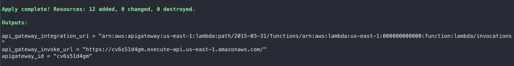
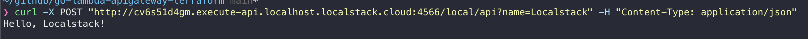
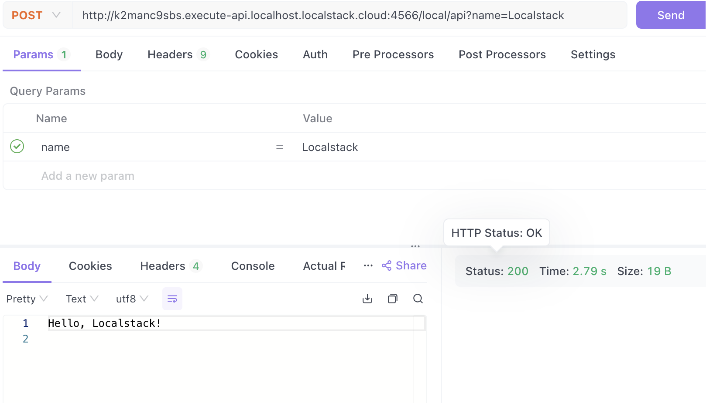

# LocalStack Demo

Simple demo to provision Lambda (Golang) + APIGateway through Terraform and LocalStack

## Prerequisites

* [LocalStack](https://docs.localstack.cloud/getting-started/installation/)
* [Docker](https://docs.docker.com/desktop/install/mac-install/)
* [AWS Cli](https://docs.aws.amazon.com/cli/latest/userguide/getting-started-install.html)
* [Terraform](https://developer.hashicorp.com/terraform/tutorials/aws-get-started/install-cli#install-terraform)


## Running LocalStack

Use the `localstack` CLI command to get started:
```
localstack start -d
```


## Deploy Lambda & APIGateway
```bash
make deploy
```

This will deploy the AWS ApiGateway integrated with Lambda (Golang) via Terraform. You can check `Makefile` for more details

If you see the outputs like below ... :point_down: Congratulations, deploy is successful :thumbsup: 


## Testing
Let's test the API endpoint. 
Run below command (replace the apigateway_id with the output you got above)
```bash
curl -X POST "http://{apigateway_id}.execute-api.localhost.localstack.cloud:4566/local/api?name=Localstack" -H "content-type: application/json"
```

If your result is like below, then congratulations ! it works as expected.




you could also use tools like POSTMAN to test it. 



## Cleanup
```bash
make destroy
localstack stop
```
